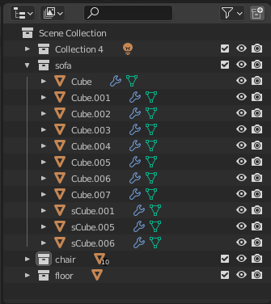
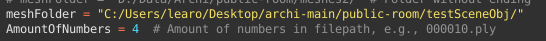
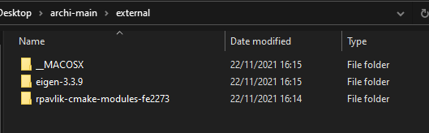
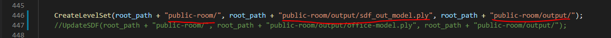
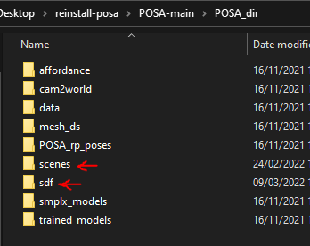

# Kyuday-project-Lea

This repository contains the work I have done during my intership at Kyushu University from August 2021 until March 2022.
My work focused on animating characters in complex environments such as rooms filled with pieces of furniture. In the future, we'll aim at making an application for interior designers, architects or anyone interested, to visualize in VR the 3D environments they created.

My work is part of a bigger project : you can find all the information about it on this website https://learostoker.github.io/Kyuday-Tsubsa-project.github.io/

To achive that goal, we used multiple existing projects such as POSA (https://github.com/mohamedhassanmus/POSA) and SAMP (https://github.com/mohamedhassanmus/SAMP)

This is still a work in progress, the application is not fully done but if you want to use want we have now, please follow the tutorial bellow.


# Place multiple characters in a room using POSA 

## SDF

SDF stands for Signed Distance Function (or Field). It is a way of describing a 2D or 3D environment and it is used by POSA to place characters in a scene.
Thus, if we want to use POSA with our own custom scene, we will need this file for each new scene mesh we create. 

## Semantics 

POSA also needs files describing the scene's semantics. Our algorithm described above also handle the creation of the semantic files.
However you need to prepare your mesh in a certain way. We used Blender so we'll explain the process with this software.

### Mesh preparation
First, make you organize your meshes properly in your scene : 
  - each piece of furniture should be under a collection (ex. all elements of a chair shoild be in a same collection)
  - the collection should be named according to POSA's semantic naming (https://github.com/mohamedhassanmus/POSA/blob/main/mpcat40.tsv)



In the SDF folder that you chose, you will find a Python script (BlenderScript) that you will need to add to your Blender mesh file.
In "Scripting"，click on "+ New" and name your file.


     
Then you can add the code. Yopu will find it in the SDF folder you chose, it's named "BlenderScript", just copy/paste it into Blender.
Don't forget to change the path of the export folder.



Once you're satisfied with your scene, in "Scripting", click the play button to export each part of your scene to the desired folder.

## Use the SDF algorithm

### Two methods to compute the SDF and semantics files
Now that your data is ready, you can get the SDF and semantic description of your scene. 
To do so, you can use either of the SDF folders in this repository. They both output the same files but using different methods, thus the results might differ. 
One uses a raycasting approach (SDF - Rays) whereas the other one requires a tetrahedralized mesh (SDF - Tetra). The SDF is then calculated by making tests on each single tetrahedra to know if our point is inside or outside of it.
We recommend starting with the raycasting method as it requires less preparation. This method works well on scene filled with simple lowpoly / blocky furniture. If your scene is more complex, we advise you to make a "simple" version of it with really simple pieces of furniture. As long as it reproduces the volume of the object, it will work with POSA. In the end, you can replace the "simple" version of your scene by the original one. 
This requires easy work on Blender but it will facilitate the next steps.

### SDF - Rays

#### REQUIREMENTS
Visual Studio <br>
Anaconda -> Python 3.x <br>
cmake <br>
CUDA <br>
cudnn <br>

#### INSTALL
Run cmake file <br>
mkdir build <br>
cd build <br>
cmake .. -D_CUDA_=TRUE -G"Visual Studio 16 2019" <br>
cmake .. -D_APPLE_=TRUE -G"Xcode" <br>
make <br>

At the root of the folder "SDF - Rays", create a new folder named "external" in which you will put the source code for Eigen (we made our tests with eigen-3.3.9 https://gitlab.com/libeigen/eigen/-/releases/3.3.9) and cmake modules from https://github.com/rpavlik/cmake-modules :



You can create a new folder and place all the meshes obtained from the Blender export. Don't forget to change the paths in src_gpu > main.cpp :



And you can now click on the play button in Visual Studio to run the code.
In the folder you chose for the ouput you can now find three files :
    - the resulting mesh (sdf_out_model.ply)
    - the sdf file (sdf.bin)
    - the semantic file (label.bin)

### Make the obtained files usables by POSA 

POSA works in Python and thus uses .npy files instead of .bin for the SDF and the semantics.
Use these two lines of code to rewrite your .bin files in .npy :
```
import numpy as np

arr = np.fromfile('sdf.bin', dtype=np.float32)
np.save('office-model_sdf.npy', arr)

arr = np.fromfile('label.bin', dtype=np.int32)
np.save('office-model_semantics.npy', arr)
```

You can change the name of the resulting files to 'your scene name'_sdf.npy and 'your scene name'_semantics.npy

### SDF - Tetra
If you chose this method, you will have to prepare the tetrahedralized mesh first and the following steps will be the same as above.
Use the folder named Tetrahedralization in this repository. Place the meshes extracted from Blender in the folder named blenderOut and run the python file named tetrahedralize.py.
The resulting tetrahedralized meshes will be in the folder named "tetrahedralized"


## POSA 
### Installation 

You first need to install POSA on your device. You can follow the instructions on their GitHub page : 
https://github.com/mohamedhassanmus/POSA

### Usage

You can now add the SDF and semantics obtained from the SDF algorithm described above, to the right folders for POSA to use.
You should put 'your scene name'_sdf.npy and 'your scene name'_semantics.npy in POSA_dir > sdf. And your orginal scene can go in POSA_dir > scenes : 



Will also need to create a JSON file named 'your scene name'.json.
You will only need to add this line of code in this file : 
```
{"min": [-5.12, -5.12, -5.12], "max": [5.12, 5.12, 5.12], "dim": 256, "bbox": [[5.12, 5.12, 10.22], [-5.12, -5.12, -0.02]], "badding_val": 6.3, "voxel_size": [0.04, 0.04, 0.04]}
```

Make sure to change the values according to the ones you entered in the SDF algorithm previously. "voxel_size corresponds to 

