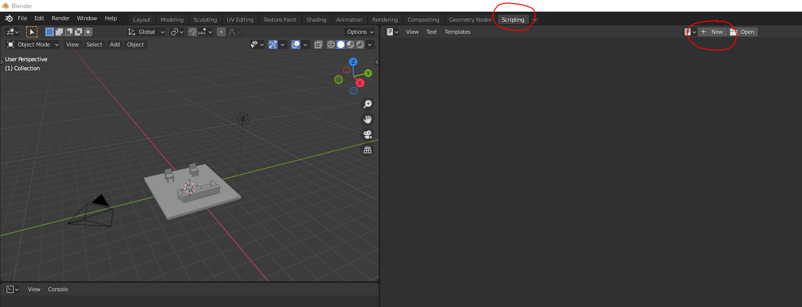

# Kyuday-project-Lea

This repository contains the work I have done during my intership at Kyushu University from August 2021 until March 2022.
My work focused on animating characters in complex environments such as rooms filled with pieces of furniture. In the future, we'll aim at making an application for interior designers, architects or anyone interested, to visualize in VR the 3D environments they created.

My work is part of a bigger project : you can find all the information about it on this website https://learostoker.github.io/Kyuday-Tsubsa-project.github.io/

To achive that goal, we used multiple existing projects such as POSA (https://github.com/mohamedhassanmus/POSA) and SAMP (https://github.com/mohamedhassanmus/SAMP)

This is still a work in progress, the application is not fully done but if you want to use want we have now, please follow the tutorial bellow.

#Tutorial

## SDF
### What is an SDF and why do we need it ?

SDF stands for Signed Distance Function (or Field). It is a way of describing a 2D or 3D environment and it is used by POSA to place characters in a scene.
Thus, if we want to use POSA with our own custom scene, we will need this file for each new scene mesh we create. 

### The algorithm and how to use it 
We created two versions of an algorithm to compute these SDF files 

## Semantics 

POSA also needs files describing the scene's semantics. Our algorithm described above also handle the creation of the semantic files.
However you need to prepare your mesh in a certain way. We used Blender so we'll explain the process with this software.

### Mesh preparation
First, make you organize your meshes properly in your scene : 
  - each piece of furniture should be under a collection (ex. all elements of a chair shoild be in a same collection)
  - the collection should be named according to POSA's semantic naming (https://github.com/mohamedhassanmus/POSA/blob/main/mpcat40.tsv)
  - 
In the SDF folder that you chose, you will find a Python script (BlenderScript) that you will need to add to your Blender mesh file.
In scripting，choose Add 

## POSA 
### Installation 
You first need to install POSA on your device. You can follow the instructions on their GitHub page : 
https://github.com/mohamedhassanmus/POSA

### Changes in the code

